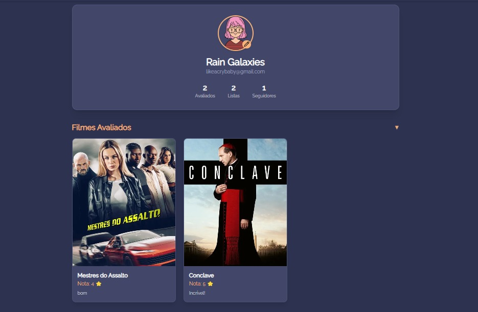

# 🎥 ReelRate
[ReelRate](https://reel-rate.vercel.app/)

O **ReelRate** é uma aplicação para amantes do cinema, permitindo avaliar filmes e interagir com outros usuários. Integrado à API da **TMDB**, oferece uma vasta seleção de títulos para explorar!

## ✨ Funcionalidades Principais
| Página | Descrição |
|:------|:---------|
| 🏠 **Home** | Veja os últimos filmes lançados com atualizações constantes. |
| 👥 **Amigos** | Encontre e siga outros usuários para compartilhar suas opiniões sobre filmes. |
| 📝 **Avaliações** | Confira todas as avaliações dos usuários e dos seus amigos em um único lugar. |
| 🎬 **Página do Filme** | Cada filme possui uma página dedicada com cartaz, sinopse, nota média e comentários. |
| 📚 **Listas de Filmes** | Crie listas personalizadas para seus filmes favoritos ou para assistir depois. |
| 🙋‍♂️ **Perfil do Usuário** | Acesse facilmente todas as avaliações feitas em seu perfil pessoal. |

---

## 📸 Exemplos de Tela

- **Página Inicial (Home)**  


- **Página de Amigos**  


- **Página de Avaliações**  


- **Detalhes do Filme**  


- **Perfil do Usuário**  


- **Perfil do Usuário**  


- **Avatares Disponíveis**  


---

## 🛠️ Tecnologias Utilizadas

🔵 Next.js

🔵 TypeScript

🔵 Prisma

🔵 Supabase

🔵 PostgreSQL

🔵 Tailwind CSS

🔵 TanStack Query

🔵 Next Auth

🔵 Axios

---

## 🚀 Como Rodar o Projeto Localmente

```bash
  cd pasta do projeto
  npm install
  npx prisma generate
  npm run dev
```

---

## 👨‍💻 Desenvolvedores

| Nome | GitHub | LinkedIn |
|:----|:------|:---------|
| Gabryel Willers | [@Gabryel-w](https://github.com/Gabryel-w) | [LinkedIn](https://www.linkedin.com/in/gabryel-willers-124426238/) |
| Julia Jung | [@juliazjung](https://github.com/juliazjung) | [LinkedIn](https://www.linkedin.com/in/juliazjung/) |
| Ana Luiza Marks | [@anxmarks](https://github.com/anxmarks) | [LinkedIn](https://www.linkedin.com/in/ana-luiza-marks-241252252/) |

---
